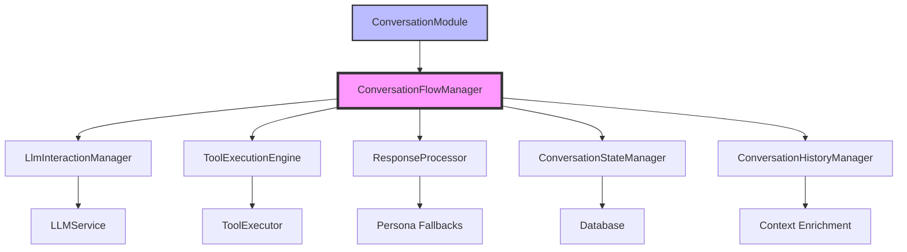

# Conversation System Documentation Index

## Overview

This index provides a complete guide to understanding and working with the Glitch Cube conversation system. The documentation has been updated to reflect the major architectural refactoring completed in January 2025.

## Quick Start

**New to the conversation system?** Start here:
1. **[Conversation System Architecture](conversation-system.md)** - Complete overview of the new modular architecture
2. **[Conversation Flow Diagrams](conversation-flows.md)** - Visual flow diagrams showing request-to-response processing
3. **[New Architecture Guide](new_conversation_architecture_guide.md)** - Deep dive into each service component

## Documentation Structure

### Core Architecture Documents

#### 🔄 [Conversation System Architecture](conversation-system.md)
**Primary reference for the conversation system**
- Complete overview of the modular architecture
- Service responsibilities and interfaces
- API endpoints and configuration
- Error handling and performance considerations
- Migration from previous monolithic design

#### 📊 [Conversation Flow Diagrams](conversation-flows.md)
**Visual guide to conversation processing**
- Updated flow diagrams showing new service interactions
- User-initiated and proactive conversation flows
- File directory reference with new service locations
- Common scenarios and debugging guidance

#### 🏗️ [New Conversation Architecture Guide](new_conversation_architecture_guide.md)
**Comprehensive implementation guide**
- Deep dive into each of the 7 core services
- Integration points with memory, tools, and Home Assistant
- Testing strategies and development best practices
- Troubleshooting common issues
- Future extensibility and enhancement possibilities

### Specification Documents

#### 📋 [Conversation Architecture Specification](conversation_architecture_spec.md)
**Technical specification for the modular design**
- Problems with the old implementation
- New architecture component design
- Interface definitions and data flow
- Performance and monitoring considerations

#### 📝 [Conversation Refactor Summary](conversation_refactor_summary.md)
**High-level summary of the refactoring effort**
- Motivation for the architectural changes
- Benefits of the new modular approach
- Key improvements and capabilities

## Related Documentation

### System Integration
- **[Tool System](../TOOL_SYSTEM.md)** - How conversation integrates with hardware tools
- **[Home Assistant Integration](home_assistant_integration.md)** - Voice pipeline and hardware control
- **[Memory System](summarization_and_context.md)** - Context injection and memory recall

### Development
- **[Persona Development](../personas/README.md)** - Creating and testing conversation personas
- **[VCR Testing Guide](ZERO_LEAK_VCR_GUIDE.md)** - Testing with external API recordings
- **[Architecture Overview](../ARCHITECTURE.md)** - Overall system architecture context

## What Changed in the Refactor

### Before (Monolithic Design)
```ruby
# Single large class handling everything
class ConversationModule
  def call(message:, context:)
    # 600+ lines of mixed responsibilities:
    # - Session management
    # - LLM interactions
    # - Tool execution
    # - Response processing
    # - Error handling
    # - State persistence
  end
end
```

### After (Modular Design)
```ruby
# Specialized services with single responsibilities
class ConversationFlowManager
  def initialize
    @state_manager = ConversationStateManager.new
    @llm_manager = LlmInteractionManager.new
    @tool_engine = ToolExecutionEngine.new
    @response_processor = ResponseProcessor.new
    @history_manager = ConversationHistoryManager.new
  end
  
  def process_conversation(message:, context:, persona:)
    # Orchestrate specialized services
  end
end
```

### Key Benefits

✅ **Separation of Concerns**: Each service has a single, well-defined responsibility

✅ **Improved Testability**: Components can be tested in isolation with mocked dependencies

✅ **Enhanced Maintainability**: Changes to one aspect don't affect unrelated functionality

✅ **Better Error Handling**: Centralized error management with context preservation

✅ **Performance Optimization**: Smart context management and cost optimization

✅ **Rich Analytics**: Comprehensive conversation metrics and performance tracking

## Architecture At-a-Glance



## Service Responsibilities Quick Reference

| Service | Responsibility | Key Files |
|---------|---------------|-----------|
| **ConversationModule** | Simple interface, persona switching | `lib/modules/conversation_module.rb` |
| **ConversationFlowManager** | Central orchestration | `lib/services/conversation/conversation_flow_manager.rb` |
| **LlmInteractionManager** | LLM communication | `lib/services/conversation/llm_interaction_manager.rb` |
| **ToolExecutionEngine** | Tool call handling | `lib/services/conversation/tool_execution_engine.rb` |
| **ResponseProcessor** | Response validation | `lib/services/conversation/response_processor.rb` |
| **ConversationStateManager** | Persistence & analytics | `lib/services/conversation/conversation_state_manager.rb` |
| **ConversationHistoryManager** | Context management | `lib/services/conversation/conversation_history_manager.rb` |

## Development Workflow

### Adding Features
1. Identify the appropriate service for your feature
2. Add functionality with proper error handling
3. Update unit tests for the service
4. Add integration tests for end-to-end functionality
5. Update relevant documentation

### Testing
```bash
# Unit tests for individual services
bundle exec rspec spec/lib/services/conversation/

# Integration tests
bundle exec rspec spec/integration/conversation_flow_spec.rb

# Console testing
bin/console
> ConversationModule.buddy.call(message: "Test message")
```

### Debugging
```bash
# Check system health
curl http://localhost:4567/api/health

# View conversation logs
tail -f logs/development.log | grep conversation

# Interactive testing
bin/console
> Services::Conversation::ConversationFlowManager.new.process_conversation(...)
```

## Common Tasks

### Understanding a Conversation Flow
1. Start with the [Flow Diagrams](conversation-flows.md) for visual overview
2. Read the [Architecture Guide](new_conversation_architecture_guide.md) for detailed service interactions
3. Look at specific service files in `lib/services/conversation/`

### Debugging Conversation Issues
1. Check the [Troubleshooting section](new_conversation_architecture_guide.md#troubleshooting-common-issues)
2. Review conversation logs with session ID
3. Test individual services in the console
4. Use VCR cassettes to isolate external API issues

### Extending Conversation Capabilities
1. Review the [Future Extensibility section](new_conversation_architecture_guide.md#future-extensibility)
2. Identify the appropriate service to modify
3. Follow the modular design patterns
4. Add comprehensive tests and documentation

## Migration Notes

The new architecture maintains complete backward compatibility:
- All existing API endpoints work unchanged
- Same request/response formats
- Tool integration points preserved
- Persona switching mechanisms maintained

However, internal service interfaces have been updated, so any custom code that directly instantiated conversation services will need updates.

## Getting Help

If you need help understanding or working with the conversation system:

1. **Start with the documentation**: This index points to comprehensive guides
2. **Use the console**: Interactive testing is often the fastest way to understand behavior
3. **Check the tests**: The test suite in `spec/lib/services/conversation/` provides working examples
4. **Review the logs**: Structured logging provides detailed execution traces

---

*Documentation updated January 2025 for the modular conversation architecture*