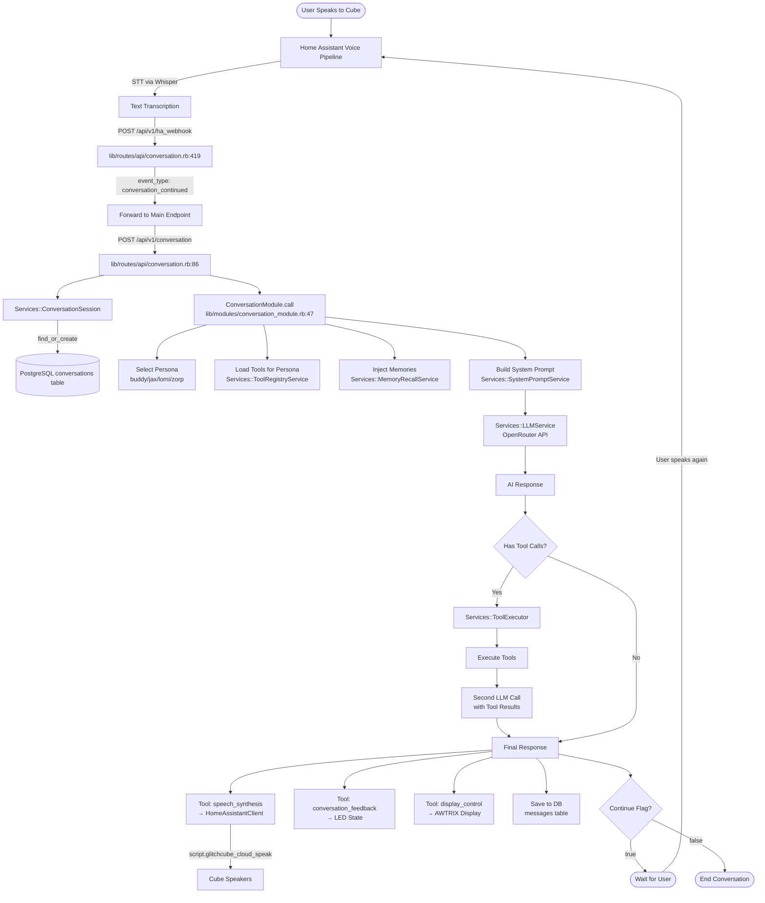
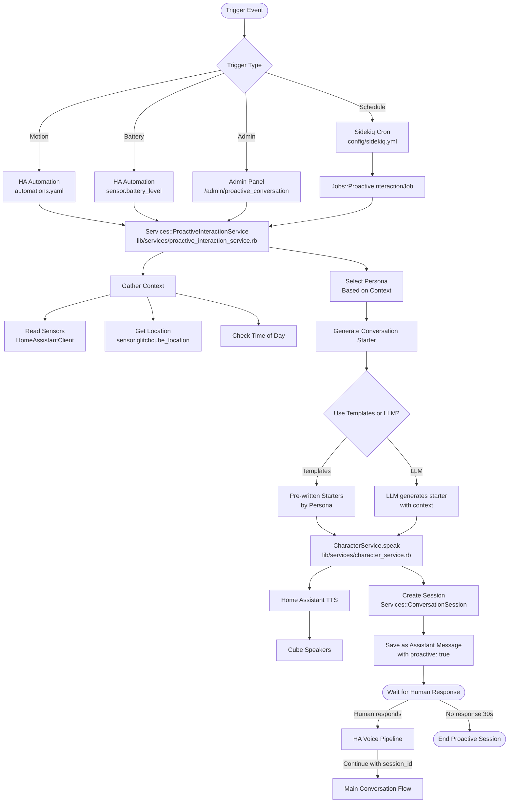
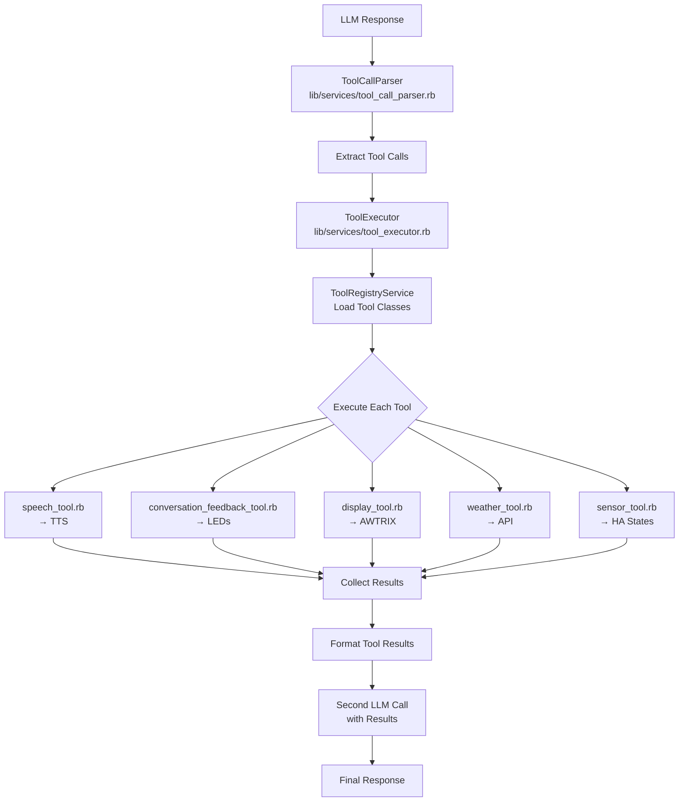

# Conversation Flow Diagrams

## Overview
This document maps the complete flow of conversations through the Glitch Cube system, showing both user-initiated and proactive conversations, including all files, triggers, and decision points.

## 1. User-Initiated Conversation Flow



### Key Files in User-Initiated Flow

| Component | File | Purpose |
|-----------|------|---------|
| Webhook Entry | `lib/routes/api/conversation.rb:419` | Receives HA voice events |
| Main Endpoint | `lib/routes/api/conversation.rb:86` | Primary conversation handler |
| Conversation Logic | `lib/modules/conversation_module.rb` | Orchestrates entire flow |
| Session Management | `lib/services/conversation_session.rb` | Manages conversation state |
| LLM Service | `lib/services/llm_service.rb` | OpenRouter API calls |
| Tool Execution | `lib/services/tool_executor.rb` | Executes requested tools |
| TTS Output | `lib/home_assistant_client.rb` | Sends speech to HA |

## 2. Proactive Conversation Flow



### Proactive Conversation Triggers

| Trigger | Location | Condition | Action |
|---------|----------|-----------|--------|
| **Motion Detection** | `config/homeassistant/automations.yaml` | `binary_sensor.cube_motion` turns on | Call `/api/v1/proactive/trigger` |
| **Scheduled Check-ins** | `config/sidekiq.yml` | Every 2 hours (10am-10pm) | Run `ProactiveInteractionJob` |
| **Low Battery** | `config/homeassistant/automations.yaml` | Battery < 20% | Trigger help request |
| **Admin Test** | `/admin/test` or `/admin/proactive_conversation` | Manual trigger | Start proactive conversation |
| **Event-based** | Custom automations | Art car nearby, music playing, etc | Context-aware greeting |

## 3. Home Assistant Conversation Agent Flow

```mermaid
graph TD
    Wake[Wake Word: Hey Nabu] --> Pipeline[HA Voice Pipeline]
    Pipeline --> STT[Speech-to-Text<br/>Whisper]
    
    STT --> Agent{Conversation Agent}
    Agent -->|Glitch Cube Agent| Custom[Custom Component<br/>custom_components/glitchcube_conversation]
    Agent -->|Fallback| Assist[HA Assist]
    
    Custom --> REST[REST Command<br/>rest_commands.yaml]
    REST --> |POST| Webhook[/api/v1/ha_webhook]
    
    Webhook --> Process[Process as Conversation]
    Process --> Response[Get AI Response]
    
    Response --> ReturnHA[Return to HA]
    ReturnHA --> HASTTS[HA TTS Service]
    HASTTS --> Audio[Play through media_player]
```

### Conversation Agent Configuration

**File**: `config/homeassistant/configuration.yaml`
```yaml
conversation:
  intents:
    GlitchCubeChat:
      - "talk to glitch cube"
      - "hey cube"
```

**File**: `custom_components/glitchcube_conversation/manifest.json`
- Registers as conversation agent
- Handles voice pipeline integration
- Routes to Sinatra backend

## 4. Session Management Flow

```mermaid
graph LR
    NewConv[New Conversation] --> CheckSession{Has session_id?}
    
    CheckSession -->|No| Generate[Generate UUID<br/>conversation_module.rb:70]
    CheckSession -->|Yes| UseExisting[Use Provided ID]
    
    Generate --> FindCreate
    UseExisting --> FindCreate[ConversationSession.find_or_create]
    
    FindCreate --> LoadHistory[Load Message History]
    LoadHistory --> AddContext[Add to LLM Context]
    
    AddContext --> LLMCall[LLM API Call]
    LLMCall --> SaveMessage[Save Response]
    
    SaveMessage --> CheckContinue{continue_conversation?}
    CheckContinue -->|true| KeepSession[Keep Session Active]
    CheckContinue -->|false| EndSession[Mark Session Complete]
    
    KeepSession --> Wait[Wait for Next Message]
    EndSession --> Cleanup[Session Cleanup<br/>After 24 hours]
```



## 5. Memory Injection Flow

```mermaid
graph TD
    Start[Conversation Start] --> GetLocation[Get Current Location]
    GetLocation --> MemoryService[MemoryRecallService<br/>lib/services/memory_recall_service.rb]
    
    MemoryService --> Query[(Query memories table)]
    Query --> Filter{Filter By}
    
    Filter --> ByLocation[Location Match]
    Filter --> ByRecency[Recent (last 24h)]
    Filter --> ByIntensity[High Emotional Intensity]
    
    ByLocation --> Select
    ByRecency --> Select
    ByIntensity --> Select[Select Top 3 Memories]
    
    Select --> Format[Format for Context]
    Format --> Inject[Inject into System Prompt]
    
    Inject --> Prompt[Final System Prompt]
    Prompt --> LLM[Send to LLM]
    
    LLM --> Response[Response References Memories]
    Response --> UpdateCount[Increment recall_count]
```

## 6. Tool Execution Flow



## File Directory Quick Reference

### Core Conversation Files
```
lib/
├── modules/
│   └── conversation_module.rb          # Main orchestrator
├── routes/
│   └── api/
│       └── conversation.rb             # HTTP endpoints
├── services/
│   ├── conversation_session.rb         # Session management
│   ├── llm_service.rb                  # OpenRouter API
│   ├── memory_recall_service.rb        # Memory injection
│   ├── tool_executor.rb                # Tool execution
│   ├── tool_registry_service.rb        # Tool discovery
│   └── proactive_interaction_service.rb # Proactive conversations
└── tools/
    ├── speech_tool.rb                   # TTS
    ├── conversation_feedback_tool.rb    # LEDs
    └── display_tool.rb                  # AWTRIX
```

### Home Assistant Integration
```
config/homeassistant/
├── configuration.yaml                   # Core HA config
├── automations.yaml                     # Motion/event triggers
├── rest_commands.yaml                   # Webhook definitions
└── custom_components/
    └── glitchcube_conversation/         # Custom conversation agent
```

### Database Models
```
app/models/
├── conversation.rb                      # Conversation records
├── message.rb                           # Individual messages
└── memory.rb                            # Extracted memories
```

## Common Scenarios

### Scenario 1: User walks up and says hello
1. Motion sensor triggers → HA automation
2. Proactive greeting plays
3. User responds with voice
4. HA voice pipeline → STT → webhook → conversation flow
5. Response plays through speakers
6. Conversation continues until LLM sets continue=false

### Scenario 2: Scheduled check-in
1. Sidekiq cron triggers at 2pm
2. ProactiveInteractionJob runs
3. Checks context (location, time, last interaction)
4. Generates contextual greeting
5. Waits for response or times out

### Scenario 3: Manual testing via admin
1. Admin visits `/admin/test`
2. Enters message and persona
3. POST to `/admin/test/conversation`
4. ConversationModule.call directly
5. Response displayed in browser
6. Session ID shown for continuation

## Debugging Tips

### Following a Conversation
1. Check `/admin/test/sessions` for session list
2. Click session to see full message history
3. Look for tool_calls in metadata
4. Check continue_conversation flags
5. Verify persona consistency

### Checking Triggers
1. **Motion**: Check HA automation history
2. **Schedule**: Check Sidekiq web UI at `/sidekiq`
3. **Webhook**: Look for POST to `/api/v1/ha_webhook` in logs
4. **Proactive**: Check for `proactive: true` in message metadata

### Common Issues
- **No response**: Check `/health` for service status
- **Wrong persona**: Verify persona in session metadata
- **No memory injection**: Check memory recall service and location sensor
- **Tools not executing**: Verify tool_calls in message metadata
- **Session not continuing**: Check continue_conversation flag from LLM

---
*Last updated: January 2025*