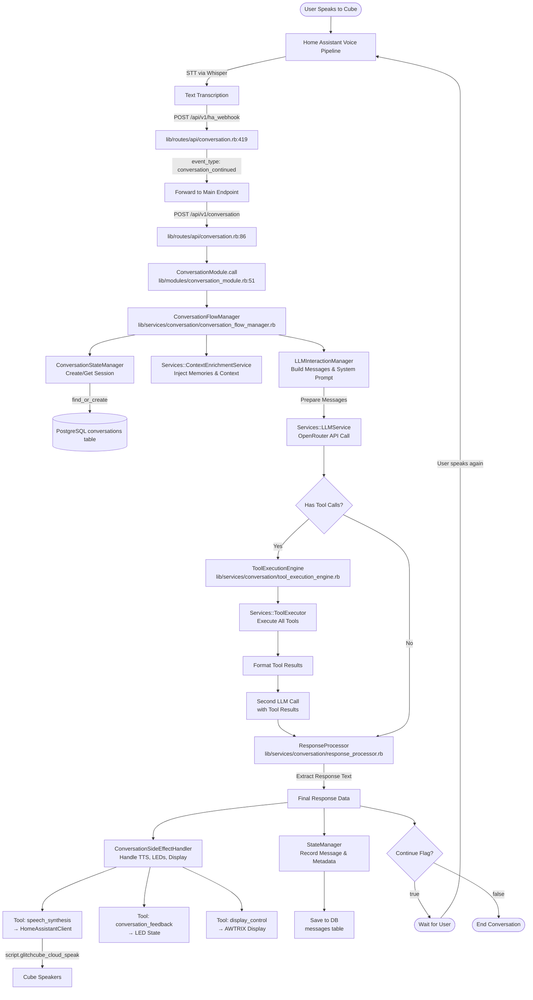
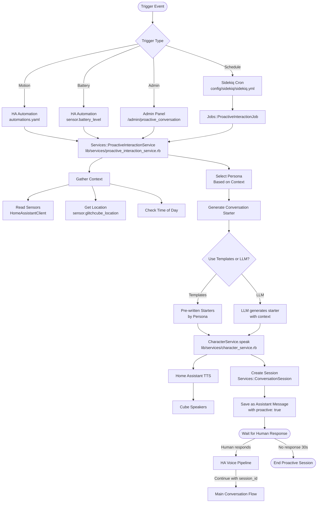
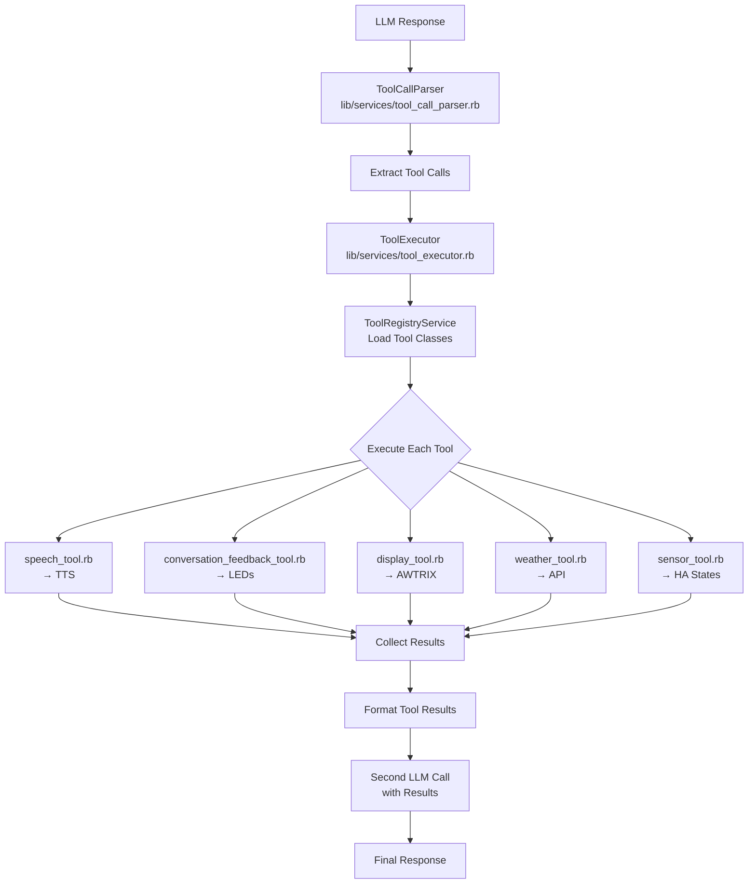

# Conversation Flow Diagrams

## Overview
This document maps the complete flow of conversations through the Glitch Cube system, showing both user-initiated and proactive conversations, including all files, triggers, and decision points. **Updated for the new modular conversation architecture (January 2025).**

## 1. User-Initiated Conversation Flow (New Architecture)


```mermaid
graph TD
    Start([User Speaks to Cube]) --> HA[Home Assistant Voice Pipeline]
    
    HA --> |STT via Whisper| Text[Text Transcription]
    Text --> |POST /api/v1/ha_webhook| Webhook[lib/routes/api/conversation.rb:419]
    
    Webhook --> |event_type: conversation_continued| Forward[Forward to Main Endpoint]
    Forward --> |POST /api/v1/conversation| Main[lib/routes/api/conversation.rb:86]
    
    Main --> CM[ConversationModule.call<br/>lib/modules/conversation_module.rb:51]
    CM --> FlowManager[ConversationFlowManager<br/>lib/services/conversation/conversation_flow_manager.rb]
    
    FlowManager --> StateManager[ConversationStateManager<br/>Create/Get Session]
    StateManager --> |find_or_create| DB[(PostgreSQL conversations table)]
    
    FlowManager --> ContextEnrich[Services::ContextEnrichmentService<br/>Inject Memories & Context]
    FlowManager --> LLMManager[LLMInteractionManager<br/>Build Messages & System Prompt]
    
    LLMManager --> |Prepare Messages| LLM[Services::LLMService<br/>OpenRouter API Call]
    
    LLM --> ResponseCheck{Has Tool Calls?}
    
    ResponseCheck -->|Yes| ToolEngine[ToolExecutionEngine<br/>lib/services/conversation/tool_execution_engine.rb]
    ToolEngine --> ToolExec[Services::ToolExecutor<br/>Execute All Tools]
    ToolExec --> ToolResults[Format Tool Results]
    ToolResults --> LLM2[Second LLM Call<br/>with Tool Results]
    LLM2 --> ResponseProcessor
    
    ResponseCheck -->|No| ResponseProcessor[ResponseProcessor<br/>lib/services/conversation/response_processor.rb]
    
    ResponseProcessor --> |Extract Response Text| FinalResponse[Final Response Data]
    
    FinalResponse --> SideEffects[ConversationSideEffectHandler<br/>Handle TTS, LEDs, Display]
    SideEffects --> TTS[Tool: speech_synthesis<br/>→ HomeAssistantClient]
    TTS --> |script.glitchcube_cloud_speak| Speaker[Cube Speakers]
    
    SideEffects --> LED[Tool: conversation_feedback<br/>→ LED State]
    SideEffects --> Display[Tool: display_control<br/>→ AWTRIX Display]
    
    FinalResponse --> StateManager2[StateManager<br/>Record Message & Metadata]
    StateManager2 --> SaveMsg[Save to DB<br/>messages table]
    
    FinalResponse --> Continue{Continue Flag?}
    Continue -->|true| WaitUser([Wait for User])
    Continue -->|false| EndSession([End Conversation])
    
    WaitUser --> |User speaks again| HA
```

### Key Files in User-Initiated Flow (New Architecture)

| Component | File | Purpose |
|-----------|------|---------|
| Webhook Entry | `lib/routes/api/conversation.rb:419` | Receives HA voice events |
| Main Endpoint | `lib/routes/api/conversation.rb:86` | Primary conversation handler |
| Conversation Entry | `lib/modules/conversation_module.rb` | Simple interface, delegates to FlowManager |
| **Flow Orchestration** | `lib/services/conversation/conversation_flow_manager.rb` | **Central orchestrator for conversation lifecycle** |
| **LLM Management** | `lib/services/conversation/llm_interaction_manager.rb` | **Message prep, model selection, API calls** |
| **Tool Execution** | `lib/services/conversation/tool_execution_engine.rb` | **Handles tool calls and execution** |
| **Response Processing** | `lib/services/conversation/response_processor.rb` | **Validates and extracts LLM responses** |
| **State Management** | `lib/services/conversation/conversation_state_manager.rb` | **Session and message persistence** |
| **History Management** | `lib/services/conversation/conversation_history_manager.rb` | **Context retrieval and summarization** |
| LLM Service | `lib/services/llm/llm_service.rb` | OpenRouter API calls |
| Tool Execution | `lib/services/tool_executor.rb` | Executes requested tools |
| TTS Output | `lib/home_assistant_client.rb` | Sends speech to HA |

## 2. Proactive Conversation Flow


```mermaid
graph TD
    Trigger([Trigger Event]) --> Type{Trigger Type}
    
    Type -->|Motion| Motion[HA Automation<br/>automations.yaml]
    Type -->|Schedule| Cron[Sidekiq Cron<br/>config/sidekiq/sidekiq.yml]
    Type -->|Battery| Battery[HA Automation<br/>sensor.battery_level]
    Type -->|Admin| Admin[Admin Panel<br/>/admin/proactive_conversation]
    
    Motion --> ProactiveService
    Cron --> ProactiveJob[Jobs::ProactiveInteractionJob]
    Battery --> ProactiveService
    Admin --> ProactiveService
    
    ProactiveJob --> ProactiveService[Services::ProactiveInteractionService<br/>lib/services/proactive_interaction_service.rb]
    
    ProactiveService --> Context[Gather Context]
    Context --> Sensors[Read Sensors<br/>HomeAssistantClient]
    Context --> Location[Get Location<br/>sensor.glitchcube_location]
    Context --> TimeCheck[Check Time of Day]
    
    ProactiveService --> SelectPersona[Select Persona<br/>Based on Context]
    SelectPersona --> GenerateStarter[Generate Conversation Starter]
    
    GenerateStarter --> Templates{Use Templates or LLM?}
    Templates -->|Templates| Starters[Pre-written Starters<br/>by Persona]
    Templates -->|LLM| GenerateLLM[LLM generates starter<br/>with context]
    
    Starters --> Speak
    GenerateLLM --> Speak[CharacterService.speak<br/>lib/services/character_service.rb]
    
    Speak --> HATTS[Home Assistant TTS]
    HATTS --> Speakers[Cube Speakers]
    
    Speak --> CreateSession[Create Session<br/>Services::ConversationSession]
    CreateSession --> SaveProactive[Save as Assistant Message<br/>with proactive: true]
    
    SaveProactive --> WaitResponse([Wait for Human Response])
    WaitResponse -->|Human responds| VoicePipeline[HA Voice Pipeline]
    VoicePipeline -->|Continue with session_id| MainFlow[Main Conversation Flow]
    
    WaitResponse -->|No response 30s| EndProactive([End Proactive Session])
```

### Proactive Conversation Triggers

| Trigger | Location | Condition | Action |
|---------|----------|-----------|--------|
| **Motion Detection** | `config/homeassistant/automations.yaml` | `binary_sensor.cube_motion` turns on | Call `/api/v1/proactive/trigger` |
| **Scheduled Check-ins** | `config/sidekiq/sidekiq.yml` | Every 2 hours (10am-10pm) | Run `ProactiveInteractionJob` |
| **Low Battery** | `config/homeassistant/automations.yaml` | Battery < 20% | Trigger help request |
| **Admin Test** | `/admin/test` or `/admin/proactive_conversation` | Manual trigger | Start proactive conversation |
| **Event-based** | Custom automations | Art car nearby, music playing, etc | Context-aware greeting |

## 3. Home Assistant Conversation Agent Flow

```mermaid
graph TD
    Wake[Wake Word: Hey Nabu] --> Pipeline[HA Voice Pipeline]
    Pipeline --> STT[Speech-to-Text<br/>Whisper]
    
    STT --> Agent{Conversation Agent}
    Agent -->|Glitch Cube Agent| Custom[Custom Component<br/>custom_components/glitchcube_conversation]
    Agent -->|Fallback| Assist[HA Assist]
    
    Custom --> REST[REST Command<br/>rest_commands.yaml]
    REST --> |POST| Webhook[/api/v1/ha_webhook]
    
    Webhook --> Process[Process as Conversation]
    Process --> Response[Get AI Response]
    
    Response --> ReturnHA[Return to HA]
    ReturnHA --> HASTTS[HA TTS Service]
    HASTTS --> Audio[Play through media_player]
```

### Conversation Agent Configuration

**File**: `config/homeassistant/configuration.yaml`
```yaml
conversation:
  intents:
    GlitchCubeChat:
      - "talk to glitch cube"
      - "hey cube"
```

**File**: `custom_components/glitchcube_conversation/manifest.json`
- Registers as conversation agent
- Handles voice pipeline integration
- Routes to Sinatra backend

## 4. Session Management Flow


```mermaid
graph LR
    NewConv[New Conversation] --> CheckSession{Has session_id?}
    
    CheckSession -->|No| Generate[Generate UUID<br/>conversation_module.rb:70]
    CheckSession -->|Yes| UseExisting[Use Provided ID]
    
    Generate --> FindCreate
    UseExisting --> FindCreate[ConversationSession.find_or_create]
    
    FindCreate --> LoadHistory[Load Message History]
    LoadHistory --> AddContext[Add to LLM Context]
    
    AddContext --> LLMCall[LLM API Call]
    LLMCall --> SaveMessage[Save Response]
    
    SaveMessage --> CheckContinue{continue_conversation?}
    CheckContinue -->|true| KeepSession[Keep Session Active]
    CheckContinue -->|false| EndSession[Mark Session Complete]
    
    KeepSession --> Wait[Wait for Next Message]
    EndSession --> Cleanup[Session Cleanup<br/>After 24 hours]
```

## 5. Memory Injection Flow

```mermaid
graph TD
    Start[Conversation Start] --> GetLocation[Get Current Location]
    GetLocation --> MemoryService[MemoryRecallService<br/>lib/services/memory_recall_service.rb]
    
    MemoryService --> Query[(Query memories table)]
    Query --> Filter{Filter By}
    
    Filter --> ByLocation[Location Match]
    Filter --> ByRecency[Recent (last 24h)]
    Filter --> ByIntensity[High Emotional Intensity]
    
    ByLocation --> Select
    ByRecency --> Select
    ByIntensity --> Select[Select Top 3 Memories]
    
    Select --> Format[Format for Context]
    Format --> Inject[Inject into System Prompt]
    
    Inject --> Prompt[Final System Prompt]
    Prompt --> LLM[Send to LLM]
    
    LLM --> Response[Response References Memories]
    Response --> UpdateCount[Increment recall_count]
```

## 6. Tool Execution Flow


```mermaid
graph TD
    LLM[LLM Response] --> Parse[ToolCallParser<br/>lib/services/tool_call_parser.rb]
    Parse --> Extract[Extract Tool Calls]
    
    Extract --> Executor[ToolExecutor<br/>lib/services/tool_executor.rb]
    Executor --> Registry[ToolRegistryService<br/>Load Tool Classes]
    
    Registry --> Execute{Execute Each Tool}
    
    Execute --> Speech[speech_tool.rb<br/>→ TTS]
    Execute --> Feedback[conversation_feedback_tool.rb<br/>→ LEDs]
    Execute --> Display[display_tool.rb<br/>→ AWTRIX]
    Execute --> Weather[weather_tool.rb<br/>→ API]
    Execute --> Sensors[sensor_tool.rb<br/>→ HA States]
    
    Speech --> Results
    Feedback --> Results
    Display --> Results
    Weather --> Results
    Sensors --> Results[Collect Results]
    
    Results --> Format[Format Tool Results]
    Format --> SecondLLM[Second LLM Call<br/>with Results]
    SecondLLM --> FinalResponse[Final Response]
```

## File Directory Quick Reference

### Core Conversation Files (New Architecture)
```
lib/
├── modules/
│   └── conversation_module.rb          # Entry point, delegates to FlowManager
├── routes/
│   └── api/
│       └── conversation.rb             # HTTP endpoints
├── services/
│   ├── conversation/                   # NEW: Modular conversation services
│   │   ├── conversation_flow_manager.rb        # Central orchestrator
│   │   ├── llm_interaction_manager.rb          # LLM communication
│   │   ├── tool_execution_engine.rb            # Tool call handling
│   │   ├── response_processor.rb               # Response validation
│   │   ├── conversation_state_manager.rb       # Session & persistence
│   │   ├── conversation_history_manager.rb     # Context & summarization
│   │   ├── conversation_error_handler.rb       # Error handling
│   │   └── errors/
│   │       └── tool_execution_error.rb         # Custom error types
│   ├── llm/
│   │   ├── llm_service.rb              # OpenRouter API client
│   │   ├── llm_response.rb             # Response parsing
│   │   └── components/                 # LLM service components
│   ├── conversation_session.rb         # Session management (existing)
│   ├── memory_recall_service.rb        # Memory injection
│   ├── tool_executor.rb                # Tool execution
│   ├── tool_registry_service.rb        # Tool discovery
│   └── proactive_interaction_service.rb # Proactive conversations
└── tools/
    ├── speech_tool.rb                   # TTS
    ├── conversation_feedback_tool.rb    # LEDs
    └── display_tool.rb                  # AWTRIX
```

### Home Assistant Integration
```
config/homeassistant/
├── configuration.yaml                   # Core HA config
├── automations.yaml                     # Motion/event triggers
├── rest_commands.yaml                   # Webhook definitions
└── custom_components/
    └── glitchcube_conversation/         # Custom conversation agent
```

### Database Models
```
app/models/
├── conversation.rb                      # Conversation records
├── message.rb                           # Individual messages
└── memory.rb                            # Extracted memories
```

## Common Scenarios

### Scenario 1: User walks up and says hello
1. Motion sensor triggers → HA automation
2. Proactive greeting plays
3. User responds with voice
4. HA voice pipeline → STT → webhook → conversation flow
5. Response plays through speakers
6. Conversation continues until LLM sets continue=false

### Scenario 2: Scheduled check-in
1. Sidekiq cron triggers at 2pm
2. ProactiveInteractionJob runs
3. Checks context (location, time, last interaction)
4. Generates contextual greeting
5. Waits for response or times out

### Scenario 3: Manual testing via admin
1. Admin visits `/admin/test`
2. Enters message and persona
3. POST to `/admin/test/conversation`
4. ConversationModule.call directly
5. Response displayed in browser
6. Session ID shown for continuation

## Debugging Tips

### Following a Conversation
1. Check `/admin/test/sessions` for session list
2. Click session to see full message history
3. Look for tool_calls in metadata
4. Check continue_conversation flags
5. Verify persona consistency

### Checking Triggers
1. **Motion**: Check HA automation history
2. **Schedule**: Check Sidekiq web UI at `/sidekiq`
3. **Webhook**: Look for POST to `/api/v1/ha_webhook` in logs
4. **Proactive**: Check for `proactive: true` in message metadata

### Common Issues
- **No response**: Check `/health` for service status
- **Wrong persona**: Verify persona in session metadata
- **No memory injection**: Check memory recall service and location sensor
- **Tools not executing**: Verify tool_calls in message metadata
- **Session not continuing**: Check continue_conversation flag from LLM

---
*Last updated: January 2025*